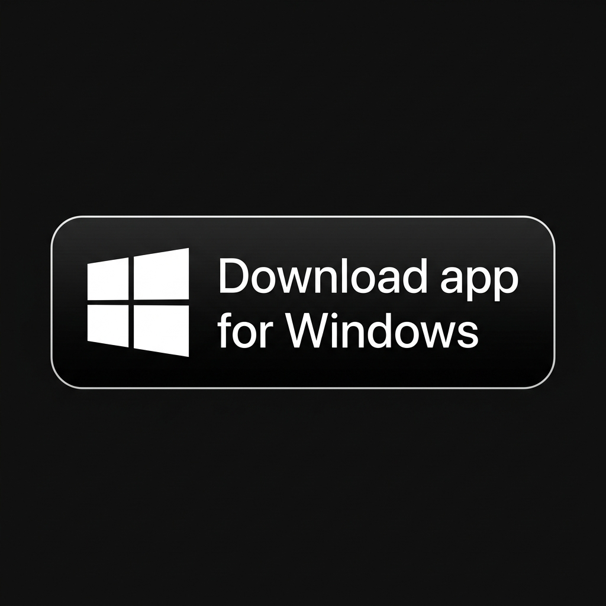

> Этот перевод создан с помощью AI. Если заметите ошибку, откройте PR.

<div align="center">

# Bin AI

**Видеоредактор, созданный для AI.**

<a href="https://github.com/martian7777/Bin-AI/releases/latest/download/BinAI.dmg">
  
</a>
<a href="https://github.com/martian7777/Bin-AI/releases/latest/download/Bin-AI-Setup.exe">
  
</a>

<sub><i>Требуется macOS 26 (Tahoe) на Apple Silicon / Windows 10/11</i></sub>


<p>
  <a href="../../README.md">English</a> ·
  <a href="README.es.md">Español</a> ·
  <a href="README.zh-CN.md">简体中文</a> ·
  <a href="README.zh-TW.md">繁體中文</a> ·
  <a href="README.ja.md">日本語</a> ·
  <a href="README.ko.md">한국어</a> ·
  <a href="README.vi.md">Tiếng Việt</a> ·
  <a href="README.hi.md">हिन्दी</a> ·
  <a href="README.bn.md">বাংলা</a> ·
  <a href="README.ar.md">العربية</a> ·
  <a href="README.it.md">Italiano</a> ·
  <a href="README.pt-BR.md">Português (Brasil)</a> ·
  <a href="README.fr.md">Français</a> ·
  <strong>Русский</strong>
</p>

</div>


---

Bin AI — open source видеоредактор для Mac. Вы и ваш agent можете вместе генерировать и редактировать видео прямо на таймлайне.

### Видеоредактор, нативный для Swift

Мы построили Bin AI с нуля на Swift. Ориентир — Premiere Pro, но с нашим подходом к интеграции AI в рабочий процесс.

### Встроенный generative AI

Генерируйте видео и изображения с помощью передовых моделей, таких как Seedance, Kling и Nano Banana Pro, прямо в редакторе таймлайна.

### Интеграция с вашими agent

Подключайте Claude, Codex или Cursor через MCP либо используйте встроенного agent в приложении, чтобы работать вместе над одним проектом.

## MCP server

Когда приложение открыто, оно предоставляет MCP server по адресу `http://127.0.0.1:19789/mcp` через HTTP. Для подключения:

**Claude Code**
```bash
claude mcp add --transport http bin-ai http://127.0.0.1:19789/mcp
```

**Codex**
```bash
codex mcp add bin-ai --url http://127.0.0.1:19789/mcp
```

**Cursor**

Самый простой способ — открыть в приложении `Help` -> `MCP Instructions` -> `Install in Cursor`. Также можно установить вручную, добавив это в `~/.cursor/mcp.json`:

```
{
  "mcpServers": {
    "bin-ai": {
      "type": "http",
      "url": "http://127.0.0.1:19789/mcp"
    }
  }
}
```

**Claude Desktop**

Мы поставляем [mcpb](https://github.com/modelcontextprotocol/mcpb) вместе с приложением, чтобы Desktop Extension для Claude Desktop можно было установить в один клик. Откройте `Help` -> `MCP Instructions` -> `Install in Claude Desktop`.

## FAQ

**Bin AI полностью open source?**

Видеоредактор, без функций generative AI, полностью open source. MCP server и agent chat тоже open source. Закрытой остается только обработка generative AI.

**Это бесплатно?**

Редактор бесплатный. Его можно скачать без входа в аккаунт и использовать как видеоредактор, например CapCut или Adobe Premiere. MCP server тоже можно использовать бесплатно и начать экспериментировать с Claude Code, Claude Desktop или Cursor для взаимодействия с редактором таймлайна.

Функции generative AI требуют входа в аккаунт и подписки.

**Какие платформы поддерживаются?**

Только macOS 26 (Tahoe) на Apple Silicon.

Подробнее см. [FAQ.md](../../FAQ.md).

## Разработка

См. [CONTRIBUTING.md](../../CONTRIBUTING.md).

## Сообщество и поддержка

- **Feedback и поддержка:** Создайте [GitHub Issue](https://github.com/martian7777/Bin-AI/issues)

## Star History

<a href="https://www.star-history.com/?type=date&repos=martian7777%2FBin-AI">
 <picture>
   <source media="(prefers-color-scheme: dark)" srcset="https://api.star-history.com/chart?repos=martian7777/Bin-AI&type=date&theme=dark&legend=top-left" />
   <source media="(prefers-color-scheme: light)" srcset="https://api.star-history.com/chart?repos=martian7777/Bin-AI&type=date&legend=top-left" />
   
 </picture>
</a>

## Лицензия

Copyright (C) 2026 Bin AI

Bin AI распространяется как open source по лицензии [GPLv3](../../LICENSE).
